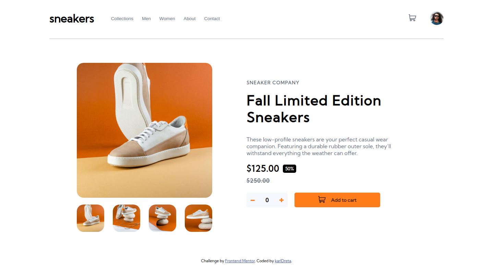

# Frontend Mentor - E-commerce product page solution

This is a solution to the [E-commerce product page challenge on Frontend Mentor](https://www.frontendmentor.io/challenges/ecommerce-product-page-UPsZ9MJp6). Frontend Mentor challenges help you improve your coding skills by building realistic projects.

## Table of contents

- [Overview](#overview)
  - [The challenge](#the-challenge)
  - [Screenshot](#screenshot)
  - [Links](#links)
- [My process](#my-process)
  - [Built with](#built-with)
  - [What I learned](#what-i-learned)
  - [Continued development](#continued-development)
  - [Useful resources](#useful-resources)
- [Author](#author)

## Overview

### The challenge

Users should be able to:

- View the optimal layout for the site depending on their device's screen size
- See hover states for all interactive elements on the page
- Open a lightbox gallery by clicking on the large product image
- Switch the large product image by clicking on the small thumbnail images
- Add items to the cart
- View the cart and remove items from it.

### Screenshot

### Links

- Solution URL: [GitHub Code](https://github.com/karldreta/Frontend-Mentor---E-commerce-product-page)
- Live Site URL: [GitHub Pages](https://karldreta.github.io/Frontend-Mentor---E-commerce-product-page)

## My process

### Built with

- Semantic HTML5 markup
- CSS custom properties
- Flexbox
- CSS Grid
- Webpack - I was practicing my Modularization and bundling

### What I learned

Taking on this challenge provided an in-depth understanding of [Webpack](https://webpack.js.org/) and ES6 Modules. Key learnings include:

* Solid grasp of Webpack and its configuration
* Enhanced skills in CSS, particularly using ::before and ::after pseudo-elements
* Implementation of a shopping cart for an E-commerce project
* Improved understanding of UX design principles

### Continued development

I plan to revisit this project after completing my current curriculum on [The Odin Project](https://www.theodinproject.com/). Future enhancements may include:

* Improved mobile responsiveness
* Implementing a carousel for image looping

### Useful resources

- [Webpack JavaScript Course](https://www.theodinproject.com/lessons/node-path-javascript-webpack) - This resource was instrumental in understanding and applying Webpack.

## Author

- GitHub - [GitHub](https://github.com/karldreta)
- Frontend Mentor - [Frontend Mentor](https://www.frontendmentor.io/profile/karldreta)
